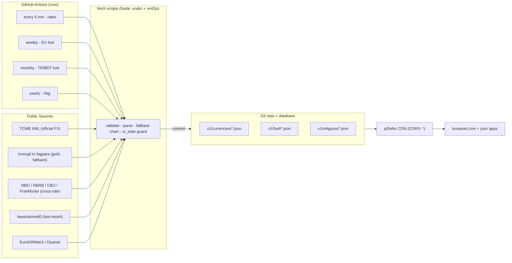

# currency-api-tr

**Free, open-source Turkish currency, gold & fuel data API — auto-updated via GitHub Actions, served over a CDN.**

[](LICENSE)
[](https://www.jsdelivr.com/package/gh/MehmetAkgul/currency-api-tr)
[](.github/workflows/update.yml)
[](tests/)


No API key. No rate limits. No server to run. Static JSON served via **jsDelivr CDN** with `Access-Control-Allow-Origin: *`, so you can `fetch()` it straight from the browser.

> Built as a transparent alternative to opaque currency APIs. Every data source is public, official where possible, and documented below.

---

## Contents

- [Why this exists](#why-this-exists)
- [Architecture](#architecture)
- [Endpoints](#endpoints)
- [Response format](#response-format)
- [Supported currencies](#supported-currencies)
- [Data sources & fallback](#data-sources--fallback)
- [Usage](#usage)
- [Freshness](#freshness)
- [Development](#development)

---

## Why this exists

Most currency APIs for Turkey either require an API key with strict rate limits, omit **bid/ask spreads**, skip **Turkish gold coins** (çeyrek, yarım, tam, Cumhuriyet), or rely on undisclosed sources. This project aggregates **TCMB's official rates** (legally mandated transparency under Law No. 1211) with **live Istanbul gold-market prices** — plus EU/TR fuel and Diyanet Hajj pricing — and serves everything free via CDN.

Actively used in production by **[kurpanel.com](https://kurpanel.com)** — a Turkish currency & gold portfolio calculator.

---

## Architecture

A pure **GitHub-Actions-as-cron + Git-as-database + CDN-as-server** design — zero infrastructure, zero running cost.



**Resilience:** every fetch runs `npm test` first, then walks a fallback chain (official API → fawaz → previous JSON). If all live sources fail, the last good value is kept and flagged `is_stale: true` — consumers never get a broken or empty response.

---

## Endpoints

| Endpoint | Data | Update |
|---|---|---|
| [`v1/currencies/try-full.json`](https://cdn.jsdelivr.net/gh/MehmetAkgul/currency-api-tr@main/v1/currencies/try-full.json) | 27 currencies + gold/silver/platinum, **bid/ask** | every 5 min |
| [`v1/currencies/try.json`](https://cdn.jsdelivr.net/gh/MehmetAkgul/currency-api-tr@main/v1/currencies/try.json) | single rate per currency (fawaz-compatible) | every 5 min |
| [`v1/fuel/eu-diesel.json`](https://cdn.jsdelivr.net/gh/MehmetAkgul/currency-api-tr@main/v1/fuel/eu-diesel.json) | EU diesel & petrol €/L by country (EC Weekly Oil Bulletin) | weekly |
| [`v1/fuel/bdt-diesel.json`](https://cdn.jsdelivr.net/gh/MehmetAkgul/currency-api-tr@main/v1/fuel/bdt-diesel.json) | Turkey & Bangladesh diesel prices | monthly (manual) |
| [`v1/religious/hac-fiyatlari.json`](https://cdn.jsdelivr.net/gh/MehmetAkgul/currency-api-tr@main/v1/religious/hac-fiyatlari.json) | Diyanet Hajj package prices (SAR) | yearly bulletin |

Base URL pattern:
```
https://cdn.jsdelivr.net/gh/MehmetAkgul/currency-api-tr@main/<endpoint>
```

---

## Response format

### `try-full.json`

```json
{
  "date": "2026-06-03",
  "updated_at": "2026-06-03T10:25:00.000Z",
  "is_stale": false,
  "sources": ["tcmb", "truncgil", "fawaz"],
  "try": {
    "usd": { "bid": 45.84, "ask": 45.92 },
    "eur": { "bid": 53.38, "ask": 53.48 },
    "xau_gram": { "bid": 6582.84, "ask": 6583.76 },
    "xau_ceyrek": { "bid": 10654.34, "ask": 10899.69 },
    "xag_gram": { "bid": 111.82, "ask": 111.82 }
  }
}
```

- `bid` = buying rate (what you get when **selling** TRY)
- `ask` = selling rate (what you pay when **buying** the currency)
- `is_stale: true` → gold data is from a previous run (truncgil + bigpara both temporarily unavailable)

### `try.json`

```json
{ "date": "2026-06-03", "try": { "usd": 0.021775, "eur": 0.018699 } }
```

Values are `1 / ask` — how many units of TRY equal 1 unit of each currency.

---

## Supported currencies

**Forex — official TCMB bid/ask (22):**
`usd` `eur` `gbp` `chf` `jpy` `sar` `aed` `azn` `cny` `kzt` `krw` `qar` `rub` `cad` `aud` `sek` `nok` `dkk` `ron` `pkr` `kwd` `xdr`

**Additional — direct central-bank APIs, cross-rated via TCMB:**
`gel` (NBG) · `byn` (NBRB) · `uzs` (CBU) · `huf` (Frankfurter/ECB) · `iqd` (fawaz fallback)

**Gold & metals:**
`xau_gram` `xau_ceyrek` `xau_yarim` `xau_tam` `xau_cumhuriyet` `xag_gram` `xpt_gram`

---

## Data sources & fallback

| Source | Data | Frequency |
|--------|------|-----------|
| [TCMB](https://www.tcmb.gov.tr) — Turkey's Central Bank | Official bid/ask for 22 currencies | Business days ~15:30 TST |
| [truncgil](https://finans.truncgil.com) | Gram gold + Turkish coins, bid/ask | Live (primary) |
| [BigPara](https://bigpara.hurriyet.com.tr) | Gram gold fallback | Live |
| [NBG](https://nbg.gov.ge) · [NBRB](https://api.nbrb.by) · [CBU](https://cbu.uz) | GEL / BYN / UZS cross-rates | Daily |
| [Frankfurter](https://api.frankfurter.app) (ECB) | HUF/EUR cross-rate | Business days |
| [fawazahmed0](https://github.com/fawazahmed0/exchange-api) | IQD, silver, platinum — last-resort fallback | Daily |
| [EuroOilWatch](https://eurooilwatch.com) (EC Weekly Oil Bulletin) | EU diesel & petrol | Weekly |
| [Diyanet](https://hacumre.diyanet.gov.tr) | Hajj package prices | Yearly bulletin |

- **FX fallback:** official central-bank API → fawaz → previous JSON (`is_stale: true`)
- **Gold fallback:** truncgil → bigpara → previous JSON (`is_stale: true`)

---

## Usage

```js
const res = await fetch(
  'https://cdn.jsdelivr.net/gh/MehmetAkgul/currency-api-tr@main/v1/currencies/try-full.json'
);
const data = await res.json();

const usdAsk      = data.try.usd.ask;        // USD sell rate in TRY
const goldGramBid = data.try.xau_gram.bid;   // Gold gram buy price in TRY
if (data.is_stale) {
  // gold prices are cached — show a "delayed" badge
}
```

Pin a specific version instead of `@main` for immutable caching:
```
https://cdn.jsdelivr.net/gh/MehmetAkgul/currency-api-tr@<commit-sha>/v1/currencies/try-full.json
```

---

## Freshness

- GitHub Actions cron: `*/5 * * * *` (rates) — every 5 minutes
- jsDelivr CDN cache: ~5–10 minutes
- **Effective freshness: 0–15 minutes**

---

## Development

```bash
npm ci
npm test                       # node:test — parsing, maps, is_stale, bigpara validation
node scripts/fetch-rates.js    # run one fetch+write cycle locally
```

Every scheduled run executes `npm test` **before** writing, so a parsing regression can never publish bad data.

---

## License

MIT
